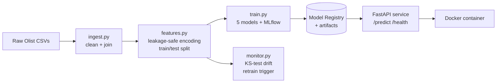
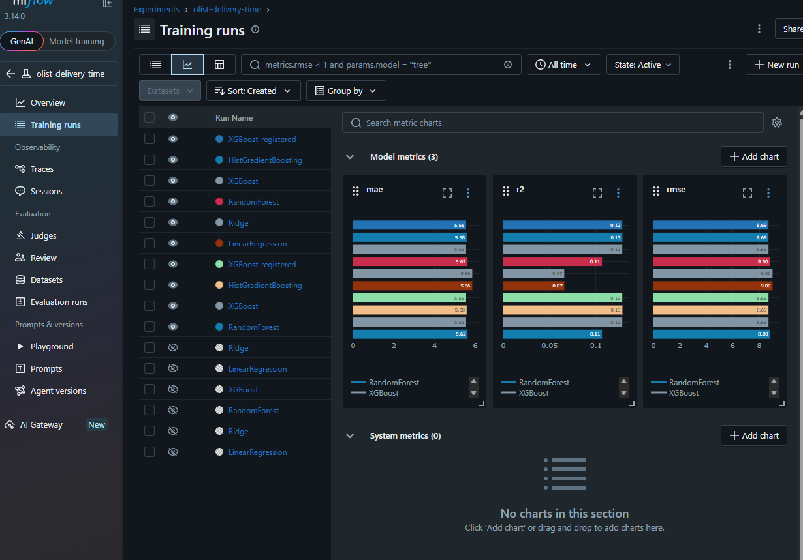
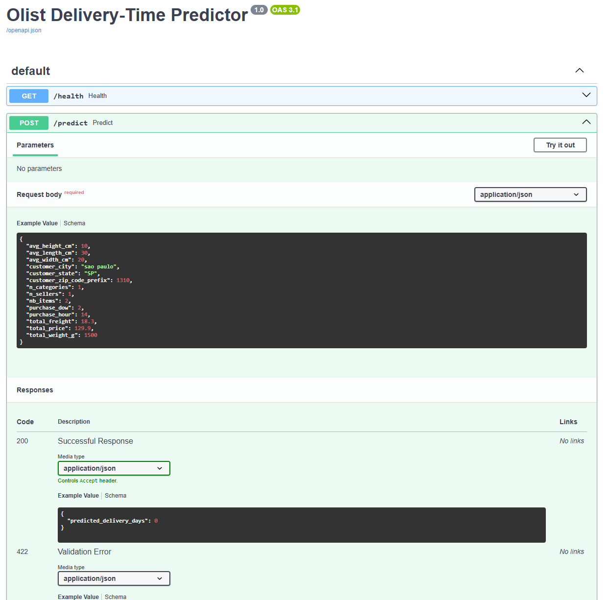
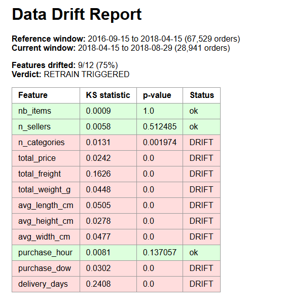

# Olist Delivery-Time Prediction: End-to-End MLOps Pipeline

Predicting e-commerce order delivery times from operational order data, built as a
complete MLOps pipeline: data ingestion, feature engineering, model training with
experiment tracking, a containerized prediction API, and automated data-drift
monitoring.

The pipeline exists in two forms: the original local version (`src/`, pandas +
scikit-learn) and a **Databricks port** (`databricks/`, PySpark + Delta Lake +
Unity Catalog + managed MLflow, orchestrated as a scheduled Workflow). See the
[Databricks section](#databricks-lakehouse-port) below.

---

## Architecture



---

## Pipeline stages

1. **Ingestion** (`src/ingest.py`): joins the relational Olist CSVs into one
   order-level table, computes the target (delivery time in days), filters to
   completed deliveries. Output: ~96K clean order records.
2. **Feature engineering** (`src/features.py`): leakage-safe transforms fit on
   the training split only: median (target) encoding for high-cardinality
   categoricals (city, zip), one-hot encoding for state, median imputation for
   missing product dimensions. Saves encoders to `artifacts/` for reuse at serve time.
3. **Training + tracking** (`src/train.py`): benchmarks five regression models,
   logs params/metrics/models to MLflow, registers the best by test MAE, and saves
   it as a standalone artifact for serving.
4. **Serving** (`api/`): FastAPI service that loads the model once at startup,
   reproduces the exact training-time feature engineering, and serves predictions
   with Pydantic-validated requests.
5. **Containerization** (`Dockerfile`): packages the API, dependencies, and model
   into a portable Linux image that runs identically anywhere.
6. **Drift monitoring** (`src/monitor.py`): compares an earlier reference window
   against later incoming data using Kolmogorov-Smirnov tests; flags a retrain when
   drift exceeds threshold.

---

## Results

Five models benchmarked; gradient boosting led.

| Model | Test MAE (days) | R² |
|---|---|---|
| **XGBoost** (selected) | **5.55** | **0.129** |
| HistGradientBoosting | 5.58 | 0.129 |
| RandomForest | 5.62 | 0.107 |
| Ridge | 5.86 | 0.066 |
| LinearRegression | 5.86 | 0.066 |

Delivery time is intrinsically hard to predict from order attributes alone. The
dominant driver (physical seller-to-customer distance) is not in the current feature
set. A distance feature computed from the Olist geolocation table is the planned next
improvement. The project's focus is the MLOps engineering rather than maximizing R².

**Drift monitoring** flagged 9 of 12 features drifted (75%) between the early and
late periods, including the target itself, correctly triggering a retrain
recommendation.

---

## Tech stack

**Modelling & serving:** Python 3.13 · scikit-learn · XGBoost · pandas · NumPy ·
MLflow · FastAPI · Uvicorn · Docker · SciPy

**Databricks port:** PySpark · Delta Lake · Unity Catalog · Databricks Workflows ·
managed MLflow (UC model registry)

---

## Project structure

```
.
├── src/
│   ├── ingest.py       # raw CSVs -> clean order-level table
│   ├── features.py     # encoding, split, saved preprocessor
│   ├── train.py        # 5-model benchmark + MLflow + registry
│   └── monitor.py      # KS-test drift detection
├── api/
│   ├── main.py         # FastAPI app: /predict, /health
│   └── schemas.py      # Pydantic request/response models
├── artifacts/          # saved model + preprocessor
├── reports/            # generated drift reports
├── databricks/         # PySpark + Delta port (see section below)
│   ├── 01_ingest.py        # Spark joins -> Delta table in Unity Catalog
│   ├── 02_features.py      # leakage-safe encoding -> Delta feature tables
│   ├── 03_train.py         # 5-model benchmark -> UC model registry
│   ├── 04_monitor.py       # Spark-native KS drift test -> Delta
│   ├── resources/          # Workflow job definition (JSON)
│   ├── docs/               # Databricks screenshots
│   ├── README.md           # port notes + porting-decision table
│   └── RUNBOOK.md          # step-by-step Free Edition setup
├── Dockerfile
├── requirements.txt        # full dev environment
└── requirements-api.txt    # minimal runtime for the container
```

---

## Running it

Data: download the "Brazilian E-Commerce Public Dataset by Olist" from Kaggle and
unzip the CSVs into `data/raw/`.

```bash
# environment
python -m venv .venv
source .venv/Scripts/activate      # Windows Git Bash; use .venv/bin/activate on macOS/Linux
pip install -r requirements.txt

# run the pipeline
python src/ingest.py
python src/features.py
python src/train.py

# view experiments
mlflow ui                          # http://127.0.0.1:5000

# serve locally
uvicorn api.main:app --reload      # http://127.0.0.1:8000/docs

# check for drift
python src/monitor.py
```

### With Docker

```bash
docker build -t olist-delivery-api .
docker run -p 8000:8000 olist-delivery-api
```

Then POST an order to `http://127.0.0.1:8000/predict` (see `/docs` for the schema).

---

## Databricks lakehouse port

The same pipeline, re-implemented on **Databricks Free Edition** with PySpark
transformations over Delta tables in Unity Catalog, managed MLflow tracking, a
UC-registered model, and a scheduled Workflow that only retrains when the drift
monitor flags it. Full setup steps are in [`databricks/RUNBOOK.md`](databricks/RUNBOOK.md);
the porting-decision table and gotchas are in [`databricks/README.md`](databricks/README.md).

```mermaid
flowchart LR
    V[Raw CSVs<br/>UC Volume] --> I[01_ingest<br/>Spark joins + target]
    I --> OC[(orders_clean<br/>Delta)]
    OC --> F[02_features<br/>leakage-safe encoding]
    F --> FT[(features_train/test<br/>Delta)]
    OC --> M[04_monitor<br/>Spark KS drift test]
    M --> DR[(drift_reports<br/>Delta)]
    M -->|retrain_triggered| C{check_drift}
    FT --> T[03_train<br/>5-model benchmark]
    C -->|true| T
    T --> REG[(delivery_time_model@champion<br/>Unity Catalog)]
```

**What the port demonstrates beyond the local version:**

- **PySpark** transformations (joins, aggregations, window functions) replacing the
  pandas equivalents, written to stay correct at scales the pandas version could not handle.
- **Delta Lake** tables with ACID writes, schema enforcement, and time travel
  (`DESCRIBE HISTORY`) in place of intermediate CSVs.
- **Unity Catalog** three-level namespacing for tables, volumes, and the model registry.
- **Managed MLflow** with the winning model registered under a `@champion` alias
  (UC aliases rather than legacy stages).
- **Databricks Workflows**: a five-task DAG with a conditional branch, where the drift
  monitor sets a task value, an If/else task reads it, and the training task runs
  only when drift is detected.

**Honest scope note:** at ~96K rows this dataset does not require Spark, and a single
pandas process is faster. The port is about the platform mechanics: Delta, Unity
Catalog, managed MLflow, Workflows, and transformations that would still hold at
1000x. It is not a performance win at this size.

Because Spark's `randomSplit` does not select the same rows as scikit-learn's
`train_test_split`, the Databricks metrics differ slightly from the local results
above; the model ranking is unchanged.

### Databricks Workflow (five-task DAG with conditional retrain)


### Unity Catalog model registry (champion alias)


---

## Screenshots

### MLflow model comparison


### FastAPI interactive docs


### Drift report


---

