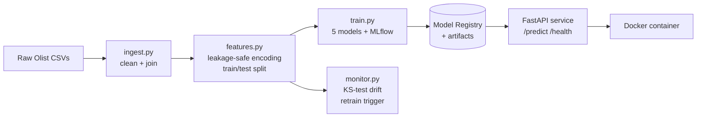

# Olist Delivery-Time Prediction — End-to-End MLOps Pipeline

Predicting e-commerce order delivery times from operational order data, built as a
complete MLOps pipeline: data ingestion, feature engineering, model training with
experiment tracking, a containerized prediction API, and automated data-drift
monitoring.

This project extends an MSc thesis on ML-based lead-time prediction by adding the
production layer the thesis left as future work, deployment, serving, and
monitoring.

---

## Architecture



---

## Pipeline stages

1. **Ingestion** (`src/ingest.py`) - joins the relational Olist CSVs into one
   order-level table, computes the target (delivery time in days), filters to
   completed deliveries. Output: ~96K clean order records.
2. **Feature engineering** (`src/features.py`) - leakage safe transforms fit on
   the training split only: median (target) encoding for high-cardinality
   categoricals (city, zip), one-hot encoding for state, median imputation for
   missing product dimensions. Saves encoders to `artifacts/` for reuse at serve time.
3. **Training + tracking** (`src/train.py`) - benchmarks five regression models,
   logs params/metrics/models to MLflow, registers the best by test MAE, and saves
   it as a standalone artifact for serving.
4. **Serving** (`api/`) — FastAPI service that loads the model once at startup,
   reproduces the exact training-time feature engineering, and serves predictions
   with Pydantic-validated requests.
5. **Containerization** (`Dockerfile`) - packages the API, dependencies, and model
   into a portable Linux image that runs identically anywhere.
6. **Drift monitoring** (`src/monitor.py`) - compares an earlier reference window
   against later incoming data using Kolmogorov-Smirnov tests; flags a retrain when
   drift exceeds threshold.

---

## Results

Five models benchmarked; gradient boosting led, consistent with the thesis findings.

| Model | Test MAE (days) | R² |
|---|---|---|
| **XGBoost** (selected) | **5.55** | **0.129** |
| HistGradientBoosting | 5.58 | 0.129 |
| RandomForest | 5.62 | 0.107 |
| Ridge | 5.86 | 0.066 |
| LinearRegression | 5.86 | 0.066 |

Delivery time is intrinsically hard to predict from order attributes alone — the
dominant driver (physical seller-to-customer distance) is not in the current feature
set. A distance feature computed from the Olist geolocation table is the planned next
improvement. The project's focus is the MLOps engineering rather than maximizing R².

**Drift monitoring** flagged 9 of 12 features drifted (75%) between the early and
late periods — including the target itself — correctly triggering a retrain
recommendation.

---

## Tech stack

Python 3.13 · scikit-learn · XGBoost · pandas · NumPy · MLflow · FastAPI · Uvicorn ·
Docker · SciPy

---

## Project structure

```
.
├── src/
│   ├── ingest.py       # raw CSVs -> clean order-level table
│   ├── features.py     # encoding, split, saved preprocessor
│   ├── train.py        # 5-model benchmark + MLflow + registry
│   └── monitor.py      # KS-test drift detection
├── api/
│   ├── main.py         # FastAPI app: /predict, /health
│   └── schemas.py      # Pydantic request/response models
├── artifacts/          # saved model + preprocessor
├── reports/            # generated drift reports
├── Dockerfile
├── requirements.txt        # full dev environment
└── requirements-api.txt    # minimal runtime for the container
```

---

## Running it

Data: download the "Brazilian E-Commerce Public Dataset by Olist" from Kaggle and
unzip the CSVs into `data/raw/`.

```bash
# environment
python -m venv .venv
source .venv/Scripts/activate      # Windows Git Bash; use .venv/bin/activate on macOS/Linux
pip install -r requirements.txt

# run the pipeline
python src/ingest.py
python src/features.py
python src/train.py

# view experiments
mlflow ui                          # http://127.0.0.1:5000

# serve locally
uvicorn api.main:app --reload      # http://127.0.0.1:8000/docs

# check for drift
python src/monitor.py
```

### With Docker

```bash
docker build -t olist-delivery-api .
docker run -p 8000:8000 olist-delivery-api
```

Then POST an order to `http://127.0.0.1:8000/predict` (see `/docs` for the schema).

---

## Screenshots

<!-- Replace these with your own images -->
- **MLflow model comparison** — `docs/mlflow.png`
- **FastAPI interactive docs** — `docs/api-docs.png`
- **Drift report** — `docs/drift.png`

---

## Background

This pipeline productionizes the modelling approach from my MSc thesis (Data Science
& Society, Tilburg University), which predicted manual packing lead times for bulky
e-commerce orders. The thesis demonstrated the model as a proof of concept; this
project adds the deployment, serving, and monitoring layers required to run such a
model in production.
